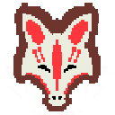

# Fox's Tale

In Fox's Tale you take the role of a statue who was brought back to life after the destruction of its hometown by a dark evil spirit. Now he has to travel through dangerous paths to save the town where he belongs while being pursued by the dark spirit who will not stop until hunting him down.
Journey through dangerous pathways with different traps and creatures.
Use your movement and abilities to dash through the level.
Never slow down or the dark spirit will get you.

This is a game (still in development) developed by students from <a href="https://www.imagecampus.edu.ar/">Image Campus</a>

   

## Credits

- **Ruffo Maximiliano** - *Programming*
- **Melina Contreras** - *Art*
- **Thiago Mandias Louzan** - *Art*
- **Lorenzo Damián Pivotto** - *Art*
- **Florencia Micaela Apodaca** - *Audio Designer*
- **Nicolas Carcagno** - *Audio Designer*
- **Juan Manuel Calabrese** - *Music Composer*
- **Matías Jara** - *Music Composer*
- **Gustavo Carrillo** - *Testing*
- **Ernesto Marquez** - *Testing*
- **José Rodriguez** - *Testing*
- **Santiago Saied** - *Testing*

## Extra Assets
- **Muizz (muizzkasim@gmail.com)** - *Font ArcadeAlternative*

## Tools
- **Unity**
- **Kitra**
- **Tiled**
- **Adobe Photoshop**
- **Piskel**
- **Visual Studio**
- **Wwise**
- **Reaper**
- **Pro Tools**

This game was also possible thanks to the support of these professors:

- **Sergio Baretto**
- **Federico Barra**
- **Jorge Cuéllar**
- **Fernando Puig**
- **Eugenio Taboada**

## Links

Download it from itch.io: https://foxs-tale-game-studios.itch.io/foxs-tale
